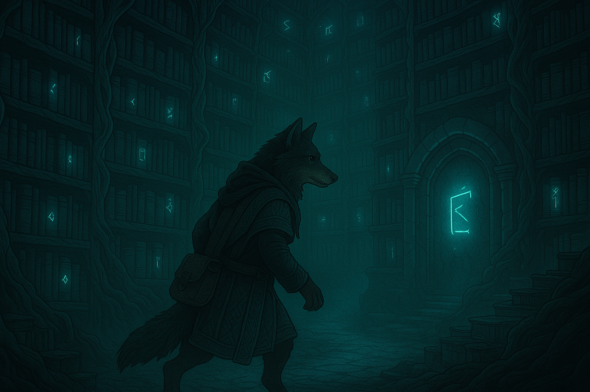

Hello, my name is OrWestSide and welcome to my digital library.

This is a space where I document my notes, experiments, findings and learnings during my voyage in the IT land. Also, it is a 
bookshelf for all the "cool" things I stumble upon in the web that I might use some day.

My interests revolve mainly around IT, but I occasionally enjoy reading scientific articles or any other articles. 

Many of the resources you will find here will short, without description and written in a sloppy form. I have noticed that
making a small example or a POC of a library, project et., really helps me understand how it works.

Feel free to explore!
